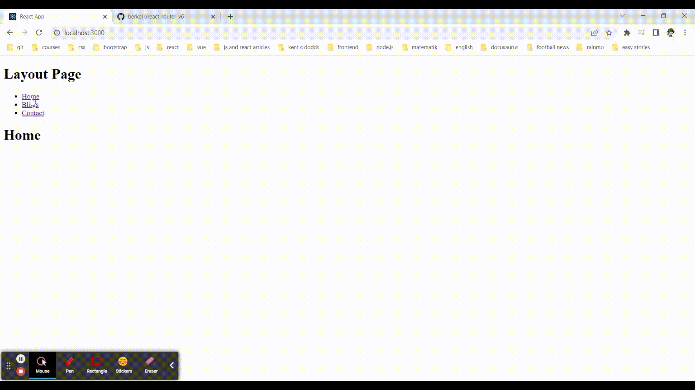

# React Router 6 - Client Side Routing

#### Documentation

 - I've used **React Router** docs and **W3Schools** Router docs for source codes and examples. 

[React Router Docs](https://reactrouter.com/docs/en/v6/getting-started/overview)

[W3Schools Router Docs](https://www.w3schools.com/react/react_router.asp)


#### Client Side Routing

- React Router enables "client side routing".

- In traditional websites, the browser requests a document from a web server, downloads and evaluates CSS and JavaScript assets, and renders the HTML sent from the server. When the user clicks a link, it starts the process all over again for a new page.

- Client side routing allows your app to update the URL from a link click without making another request for another document from the server. Instead, your app can immediately render some new UI and make data requests with fetch to update the page with new information.

- This enables faster user experiences because the browser doesn't need to request an entirely new document or re-evaluate CSS and JavaScript assets for the next page. It also enables more dynamic user experiences with things like animation.

- Client side routing is enabled by creating a Router and linking/submitting to pages with ``Link`` and ``<Form>``.


#### Create A React Application

```sh
npx create-react-app router
```

<br>

> **Note:** Create React App doesn't include page routing. 

#### Install react-router-dom

```sh
npm i react-router-dom
```

> Now that we have react app and react-router-dom installed in the project directory.

#### Components (Pages)

> To create an application with multiple page routes, let's first start with the file structure. Within the ``src`` folder, we'll create a folder named pages with several files.

##### src/pages/: 
- Layout.js
- Home.js
- Blogs.js
- Contact.js
- NoPage.js  

Each file will contain a very basic React component.


#### Usage

> Now we will use our Router in our ``index.js`` file to route to pages based on URL.

- ##### index.js

```js
import ReactDOM from "react-dom/client";
import { BrowserRouter, Routes, Route } from "react-router-dom";
import Layout from "./pages/Layout";
import Home from "./pages/Home";
import Blogs from "./pages/Blogs";
import Contact from "./pages/Contact";
import NoPage from "./pages/NoPage";


// Function component

export default function App() {
  return (
    <BrowserRouter>
      <Routes>
        <Route path="/" element={<Layout />}>
          <Route index element={<Home />} />
          <Route path="blogs" element={<Blogs />} />
          <Route path="contact" element={<Contact />} />
          <Route path="*" element={<NoPage />} />
        </Route>
      </Routes>
    </BrowserRouter>
  );
}

const root = ReactDOM.createRoot(document.getElementById("root"));
root.render(<App />);
```

#### Notes for index.js:

- We wrap our content first with ``<BrowserRouter>``.

- Then we define our ``<Routes>``. An application can have multiple ``<Routes>``. Our basic example only uses one.

- ``<Route>'s`` can be nested. The first ``<Route>`` has a path of / and renders the ``Layout`` component.

- The nested ``<Route>'s`` inherit and add to the parent route. So the blogs path is combined with the parent and becomes /blogs.

- The ``Home`` component route does not have a path but has an index attribute. That specifies this route as the default route for the parent route, which is /.

- Setting the path to ``*`` will act as a catch-all for any undefined URLs. This is great for a 404 error page.

#### Pages (Components)

- The ``Layout`` component has ``<Outlet>`` and ``<Link>`` elements.

- The ``<Outlet>`` renders the current route selected.

- ``<Link>`` is used to set the URL and keep track of browsing history.

- Anytime we link to an internal path, we will use ``<Link> ``instead of ``<a href="">``.

- The ``"layout route"`` is a shared component that inserts common content on all pages, such as a navigation menu.

- ##### Layout.js

```js
// import React  from "react";   // With the new transform, you can use JSX without importing React.

import { Outlet, Link } from "react-router-dom";

// Function component
const Layout = () => {
  return (
    <div>
      <h1>Layout Page</h1>
      <nav>
        <ul>
          <li>
            <Link to="/">Home</Link>
          </li>
          <li>
            <Link to="/blogs">Blogs</Link>
          </li>
          <li>
            <Link to="/contact">Contact</Link>
          </li>
        </ul>
      </nav>

      <Outlet />
    </div>
  );
};

export default Layout;
```

- ##### Home.js

```js
// import React from 'react';   // With the new transform, you can use JSX without importing React.


// Function component = rfc + enter

export default function Home() {
  return (
    <div>
        <h1>Home</h1>
    </div>
  )
}
```

- ##### Blogs.js

```js
// import React  from "react";   // With the new transform, you can use JSX without importing React.


// Function component

const Blogs = () => {
  return <h1>Blog Articles</h1>;
};

export default Blogs;
```

- ##### Contact.js

```js
// import React  from "react";   // With the new transform, you can use JSX without importing React.


// Function component

const Contact = () => {
  return <h1>Contact Me</h1>;
};

export default Contact;
```
- ##### NoPage.js

```js
// import React  from "react";   // With the new transform, you can use JSX without importing React.


// Function component

const NoPage = () => {
  return <h1>404 - Not Found!</h1>;
};

export default NoPage;
```


